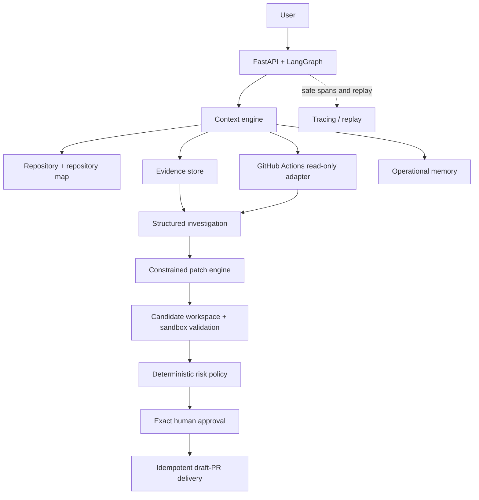

# Base64 Ops

Evidence-first AI operations engineer for investigating repository and CI failures, preparing constrained fixes, and delivering them only after exact human approval.

Base64 Ops is designed to demonstrate a safer workflow than “LLM + terminal”: it gathers provenance-backed evidence, reconstructs the revision where an incident occurred, separates historical failures from current defects, validates candidate changes, classifies deterministic risk, and binds approval to the exact bytes that will be delivered.

## What it does

- Investigates repository, Docker, configuration, and GitHub Actions failures.
- Turns bounded, redacted CI logs and source files into first-class Evidence.
- Compares failed-run SHA state with current HEAD to avoid patching already-fixed incidents.
- Produces constrained unified diffs in an isolated candidate workspace.
- Runs deterministic validation, applies risk policy, and requires approval before creating a draft PR.
- Replays investigations without re-running historical actions.
- Records verified operational memory without allowing historical memory to override current evidence.

## Why it is different

Base64 Ops does not immediately patch a log line. It collects evidence, reconstructs failure state, validates candidate changes, and binds approval to the exact plan, base SHA, diff, and arguments. Repository files, workflow YAML, CI logs, and memory are treated as untrusted data—not instructions.

## Flagship demo

The primary deterministic scenario models a frontend moved to `./client` while GitHub Actions still runs from `./server`.

```text
Why did my PR checks fail?
  → CI log: package.json missing under ./server
  → workflow at failed SHA: working-directory ./server
  → repository evidence: package lives in ./client
  → current applicability: CURRENT
  → proposed workflow correction: HIGH risk
  → exact diff + validation + approval → draft PR
```

A second scenario demonstrates historical intelligence: the failed workflow used `./server`, but current HEAD already uses `./client`. Base64 explains the historical cause and prepares no duplicate patch.

See [DEMO_SCRIPT.md](docs/DEMO_SCRIPT.md) for the 5–8 minute walkthrough.

## Architecture



## Quick start

```powershell
Copy-Item backend/.env.example backend/.env
Copy-Item client/.env.example client/.env
cd backend; python -m venv venv; .\venv\Scripts\Activate.ps1; pip install -r requirements.txt
cd ../client; npm install
.\scripts\verify.ps1
```

For a guided local demo setup, run `./scripts/demo.ps1`. It does not create GitHub data, bypass approval, or claim a real PR. Live GitHub Actions verification remains **not exercised** unless explicitly run with authorized credentials.

## Evaluation and verification

```powershell
cd backend
python -m pytest -q
python -m ruff check .
python -m evals.runner --mode deterministic
python -m evals.runner --mode deterministic --category ci
```

Latest local deterministic baseline: **120 backend tests** and **28/28 deterministic evals** passed. Evaluation output contains only measured results.

See [EVALUATION.md](docs/EVALUATION.md), [DEMO_SCRIPT.md](docs/DEMO_SCRIPT.md), [INTERVIEW_TALK_TRACK.md](docs/INTERVIEW_TALK_TRACK.md), [SYSTEM_DESIGN.md](docs/SYSTEM_DESIGN.md), and [THREAT_MODEL.md](docs/THREAT_MODEL.md).
