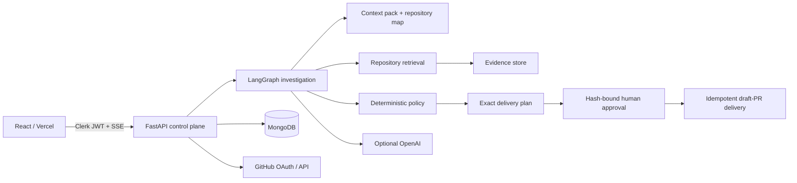
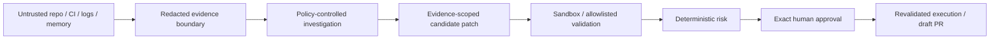

# Architecture

The graph is intentionally small: workspace context, repository map, retrieval, optional read-only GitHub Actions context, action selection, investigation scaffold, optional approval, execution, and response. CI logs and workflow files enter only as untrusted, redacted evidence; they never become commands or mutation authority. The UI exposes safe execution events and evidence rather than hidden model reasoning.

## Safety boundary

No edge in this diagram lets content from the left register a validator, change policy, disclose credentials, or authorize execution.
