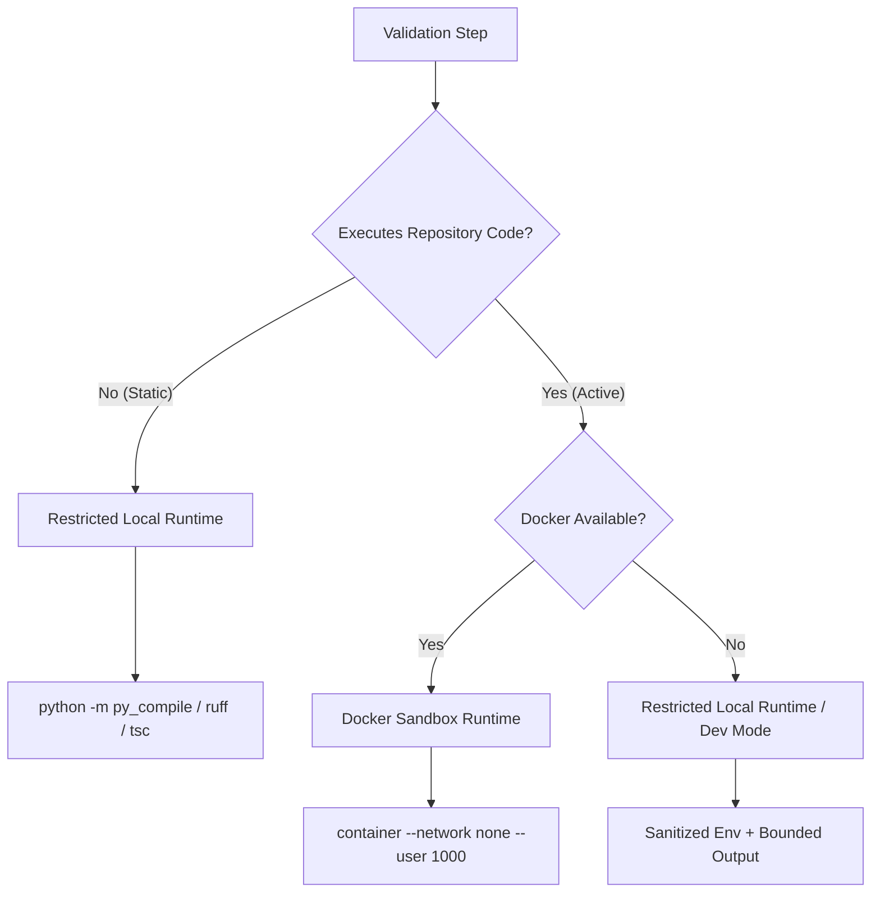

# Execution Runtime Sandbox

## Overview

Base64 Ops executes repository-controlled validation commands (e.g., `pytest`, `npm test`, `mvn test`) within a bounded, observable, least-privilege execution runtime. Hostile repository code cannot access server credentials, host environment secrets, host filesystems, or host Docker sockets.

---

## Threat Model

| Threat | Mitigation | Status |
| --- | --- | --- |
| Environment secret exfiltration | Freshly sanitized environment (`ExecutionPolicy.sanitize_environment()`) stripping all `*_TOKEN`, `*_SECRET`, `*_KEY`, `AWS_*`, `OPENAI_*`, `CLERK_*`, `MONGO_*` variables. | Enforced |
| Network data exfiltration | Containers execute with `--network none` (Docker sandbox) or restricted network policy. | Enforced |
| Host filesystem escape | Ephemeral container volume mounts only candidate workspace; path policy rejects absolute/drive-letter/relative path escapes. | Enforced |
| Resource exhaustion | Configurable CPU, memory (`--memory 1024m`), and timeout bounds (`120s`). | Enforced |
| Process tree survival | Timeout triggers full process tree termination (`taskkill /F /T /PID` or `os.killpg`). | Enforced |
| Unlimited output memory exhaustion | Stdout/stderr buffers capped to `max_patch_content_bytes` with truncation flag and secret redaction. | Enforced |
| Candidate patch tampering | Post-validation workspace integrity check re-verifies proposed file content SHA-256 hashes against original candidate proposals. | Enforced |
| Unauthorized side-effects | Detects unexpected tracked file mutations or sensitive file creations (`.env`, `credentials.json`) during validator execution. | Enforced |

---

## Static vs Active Validation

### Static Validation
- **Examples**: Python syntax compilation (`py_compile`), Ruff linting (`ruff`), TypeScript compiler (`tsc --noEmit`), Docker Compose syntax check (`docker compose config`).
- **Isolation**: Restricted Local Runtime with environment sanitization and process tree timeout limits.

### Active Validation
- **Examples**: `pytest`, `npm run build`, `mvn test`, `cmake --build`.
- **Isolation**: Ephemeral Docker Sandbox (`docker run --rm --network none --memory 1024m`).

---

## Workspace Integrity & Side-Effect Detection

Before executing any validator, `ExecutionPolicy` takes a snapshot of workspace file SHA-256 hashes.
After execution:
1. Re-verifies that every proposed edit file matches its exact approved candidate content hash. If modified, raises `ExecutionPolicyError("Validation altered proposed source file")`.
2. Scans for unexpected sensitive file creations (e.g. `.env`, `credentials.txt`). If detected, validation fails immediately.

---

## Platform Limitations

- **Windows Local Fallback**: When Docker is unavailable, the Restricted Local Runtime relies on Python process groups and `taskkill` for process tree termination. Network isolation requires Docker sandbox containers (`--network none`).
