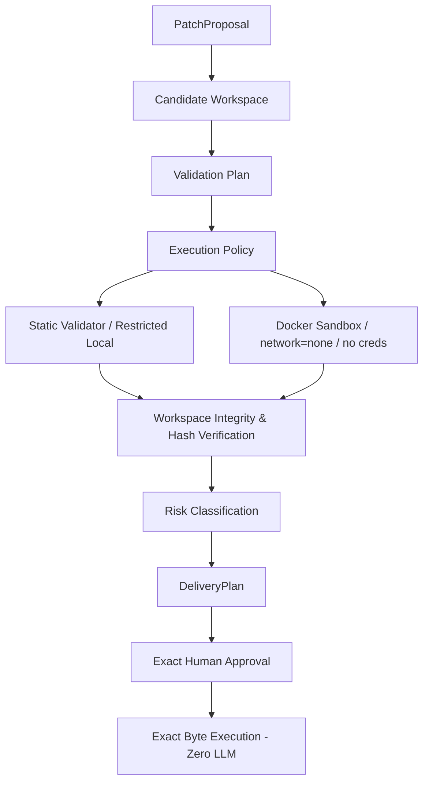

# Constrained General Patch Engine & Execution Sandbox

## Overview

Base64 Ops employs a constrained, evidence-backed general patch generation engine. The LLM generates structured candidate edit proposals (`PatchProposal`), while deterministic backend code validates path security, original file content hashes, sensitive file policies, patch size bounds, command injections, candidate workspace application, validation execution through an isolated runtime sandbox, surface classification, and risk levels.



---

## 1. Candidate File Selection

A repository file may be modified only if it falls within the deterministic investigation candidate boundary:
1. **Directly retrieved evidence**: Indexed snippet or file retrieved during RAG search.
2. **Explicitly referenced file**: Source referenced directly by retrieved evidence.
3. **RepositoryMap relation**: Dependency or configuration file identified in container, CI, or manifest maps.
4. **Deterministic workflow creation**: New file required by an approved deterministic workflow.

Un-evidenced or arbitrary file path proposals generated by the LLM are rejected with `PatchSafetyError`.

---

## 2. Structured Edit Intents

The LLM is restricted to returning structured JSON schema (`PatchProposal`):

```python
class FileEditIntent(BaseModel):
    path: str
    operation: Literal["modify", "create", "delete"]
    reason: str
    evidence_ids: list[str]
    expected_original_hash: str | None = None
    proposed_content: str | None = None

class PatchProposal(BaseModel):
    summary: str
    rationale: str
    evidence_ids: list[str]
    edits: list[FileEditIntent]
    assumptions: list[str] = []
    unresolved_questions: list[str] = []
```

The model NEVER produces shell commands, git commands, authorization decisions, or unconstrained diffs.

---

## 3. Path Security Policy

The `RepositoryPathPolicy` strictly validates all target paths prior to disk or candidate workspace access:
- **Path Traversal**: Rejects `../`, `/../`, `..\`.
- **Absolute / Drive Letter**: Rejects `/etc`, `C:\`, `\var`.
- **Restricted Directories**: Rejects `etc/`, `var/`, `proc/`, `sys/`, `windows/`, `system32/`, `.ssh/`, `.git/`.
- **Symlinks**: Resolves symlinks and verifies target remains inside repository root.

---

## 4. Sensitive File Policy

Secret-bearing files are blocked from creation or modification:
- `.env`, `.env.*` (except `.env.example` or `.env.template` if free of secrets)
- `credentials*`, `*.pem`, `*.key`, `*.p12`, `*.pfx`, `id_rsa`, `id_ed25519`, `private_key*`

---

## 5. Patch Size Limits

Configured via `Settings`:
- `max_patch_files`: 8
- `max_patch_lines`: 500
- `max_patch_file_bytes`: 500,000 bytes (500 KB)
- `max_patch_content_bytes`: 250,000 bytes (250 KB)

Proposals exceeding these bounds raise `PatchSafetyError("Patch proposal exceeds safe automatic-edit scope")` without executable delivery.

---

## 6. Original Hash & Stale Proposal Detection

Before creating a `DeliveryPlan`, the patch engine computes `SHA-256(original_content)` and verifies it matches `expected_original_hash`.

Before execution, `DeliveryService.execute` re-validates that target files on disk still match `original_hash`. If modified, execution fails immediately:
> *"The source file changed after the remediation was generated. Proposal must be regenerated against the current repository state."*

---

## 7. Isolated Candidate Workspace & Runtime Sandbox

Pre-approval patch testing occurs in a temporary isolated workspace (`tempfile.mkdtemp`):
1. Copy repository files to candidate workspace (excluding `.git`).
2. Apply proposed file edits.
3. Compute exact unified diff using `difflib.unified_diff`.
4. Run pre-approval validation using `ExecutionRuntimeManager` (`RestrictedLocalRuntime` for static analysis, `DockerSandboxRuntime` with `--network none` for active validation).
5. Clean up candidate directory.

No branch creation or repository mutation occurs until explicit human approval.

---

## 8. Capability Detection & Validation Plan

`PatchEngine.detect_capabilities` deterministically identifies project capabilities:
- **Python**: `pyproject.toml`, `requirements.txt` -> `python-syntax`, `ruff`
- **TypeScript**: `package.json`, `tsconfig.json` -> `tsc --noEmit`
- **Docker Compose**: `docker-compose.yml` -> `docker compose config`
- **Java**: `pom.xml`, `build.gradle` -> `mvn test`, `gradle test`
- **C++**: `CMakeLists.txt` -> `cmake build`

Arbitrary shell scripts suggested in repository text are never executed.

---

## 9. Static Sanity Checks

Before delivery plan creation, candidate contents are scanned for suspicious injections:
- Command injection patterns (`curl | sh`, `wget | sh`, `os.system`, `subprocess(shell=True)`, `eval`, `base64 decode + exec`)
- Secret printing (`print(password)`, `print(token)`)

Suspicious edits trigger `PatchSafetyError("Security review required: suspicious generated content detected")`.

---

## 10. Exact Approval Execution Invariant

Once user approval is granted:
- **Zero LLM Invocation**: The LLM is never invoked post-approval to re-write, re-generate, or re-touch code.
- **Exact Byte Application**: `DeliveryService.execute` applies the exact pre-validated `proposed_content` bytes bound to the approved `diff_hash`.
